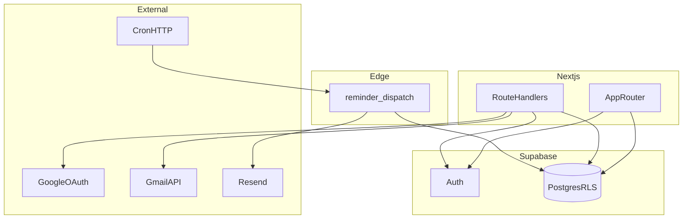

# Architecture

## Overview

SubI is a Next.js app backed by Supabase Postgres with strict Row Level Security. Users sign in with Supabase (Google, Sign in with Apple, or email magic link), then optionally complete a **second** Google OAuth flow to obtain Gmail read-only tokens stored encrypted in `email_accounts`. Multiple mailboxes per user are allowed on **pro** (`users.plan`); **free** is capped at one connected mailbox, and the Gmail address must match `auth.users.email` when that email is present.

A modular parser extracts subscription-like rows from email; the dashboard lists them grouped by mailbox vs manual. Pending `notifications` rows store UTC `notify_at` instants; a Supabase Edge Function (with service role + Resend) sends due reminders on an external cron schedule.

## Layers

- **UI:** `app/`, `components/`, `hooks/` — React Server Components where practical; TanStack Query for subscription listing and mutations.
- **Services:** `services/*.service.ts` — orchestrate repos + integrations (Gmail sync, notification reconciliation).
- **Repositories:** `repositories/*.repository.ts` — Supabase reads/writes; no Gmail or Resend here.
- **Integrations:** `lib/gmail/`, `lib/email/`, `lib/email-providers/`, `lib/parsers/`, `lib/crypto/`.

## Auth flows

1. **App login:** Supabase `signInWithOAuth` (Google / Apple) or `signInWithOtp` (email) → `/auth/callback` exchanges code for session (SSR cookies).
2. **Gmail connect:** `/api/gmail/auth` sets CSRF `state` cookie → Google consent → `/api/gmail/callback` validates state, loads Google userinfo for `provider_email`, enforces plan + email rules, encrypts tokens into `email_accounts`.
3. **Gmail sync:** `POST /api/sync/gmail` with JSON `{ "emailAccountId": "<uuid>" }` (optional when exactly one Gmail mailbox exists). Rate limit key is user + mailbox id.
4. **Disconnect:** `DELETE /api/email-accounts/[id]` removes a mailbox row. Linked subscriptions have `email_account_id` set to `null` (FK `on delete set null`).

## Gmail sync

- **Initial:** Message list with Gmail query `newer_than:90d` + keyword clause; capped message count (`INITIAL_MESSAGE_CAP`).
- **Incremental:** `users.history.list` from stored `gmail_history_id`; on expired history, fall back to initial backfill.
- **Parsing:** `BasicKeywordParser` implements `SubscriptionParser`; duplicates allowed; `normalized_name` supports light UI grouping within a mailbox section.

## Reminders

- **Scheduling:** `reconcileNotificationsForUser` deletes pending rows per subscription, then inserts one pending row per `(subscription, notify_at)` from user timezone + `reminder_preferences`.
- **Dispatch:** Edge function selects `pending` rows with `notify_at <= now()`, `attempt_count < 2`, sends email, updates `status` / `attempt_count` / `provider_message_id`.

## Mailboxes and plans

- **`users.plan`:** `free` | `pro` — enforces how many `email_accounts` rows a user may own (see repository / callback).
- **`subscriptions.email_account_id`:** nullable FK to the mailbox that produced a Gmail import; manual rows use `null`.
- **`lib/email-providers/registry.ts`:** declares live vs coming providers (Outlook, Yahoo stubbed in DB enum only).

## Extensibility (inbox)

- Additional inbox providers: add registry entry, OAuth + sync adapter, and reuse `email_accounts` + `subscriptions.email_account_id`.
- Heavy Gmail volume: move sync to queued workers if route timeouts become an issue.

## Diagram (logical)

